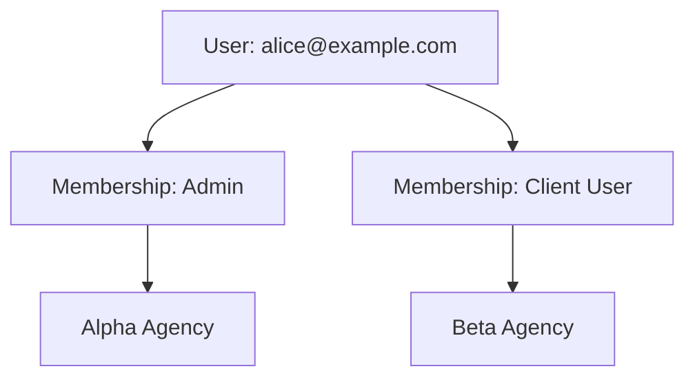

# AgencyDesk Architecture & Design

Welcome to the definitive guide on AgencyDesk's internal engineering architecture. We've built this to be robust, secure, and scalable for multi-tenant applications.

---

## 1. Tenant Isolation

Tenant isolation is enforced deeply at the database schema level. Every domain entity (`tasks`, `projects`, `clients`, `comments`, `time_entries`, `attachments`) has a direct `agency_id` foreign key.

In the FastAPI backend, every endpoint requires an `agency_id` path parameter. The `get_current_membership` dependency explicitly verifies that the currently authenticated user has a valid row in the `memberships` table for that specific `agency_id`. Once inside the router logic, every single SQLAlchemy query is appended with `.filter(Entity.agency_id == agency_id)`. This guarantees that even if a user guesses a valid UUID for a project in another agency, the query will yield zero results.

---

## 2. Client Visibility & Internal Content Filtering

Clients are blocked from seeing internal content through a strict role-based filter applied at the query level, not just the UI level.

Entities that can be internal (`tasks`, `comments`, `attachments`) possess an `is_internal` boolean flag. In the routers, we check the requester's role (extracted from their `Membership` record). If `membership.role == "client_user"`, the query is automatically modified to append `.filter(Entity.is_internal == False)`. This ensures internal data never leaves the server when queried by a client. Furthermore, clients are explicitly blocked from mutation endpoints (403 Forbidden) for time entries, task creation, and internal flags.

---

## 3. Multi-Agency Identity Model

To solve the "one person, two agencies" problem, the system separates `User` (identity) from `Membership` (authorization).

The `users` table holds only identity credentials (email, hashed_password). Roles do not exist on the user object. Instead, roles live on the `memberships` table, which maps a `user_id` to an `agency_id` with a specific `role` enum. This many-to-many relationship means `alice@example.com` can authenticate once, but act as an `agency_admin` in "Alpha Agency" and a `client_user` in "Beta Agency". JWTs are scoped per agency login, embedding the specific role the user holds in that active context.

---

## 4. Edge Case Highlight: Safe Assignee Removal

When an `agency_member` is removed from a project, they may have active tasks assigned to them. Deleting the member naively would trigger a constraint violation or cascade delete the task.

To prevent this, the schema defines the `assignee_membership_id` foreign key on the `tasks` table with `ON DELETE SET NULL`. Furthermore, the `DELETE /projects/{id}/members/{id}` endpoint executes an explicit update query setting `assignee_membership_id = NULL` for all tasks in the project belonging to that user. This preserves the task history and prevents destructive cascading deletes.

---

## 5. Multi-Tenant Architecture Overview

*Designed by the masters of multi-tenancy.*
