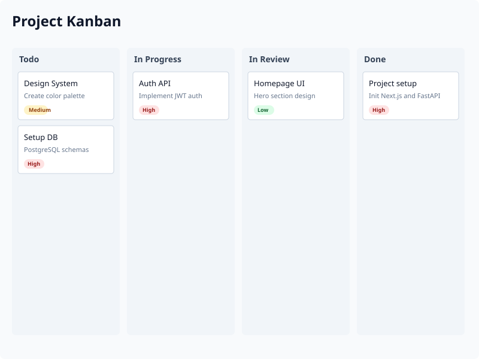
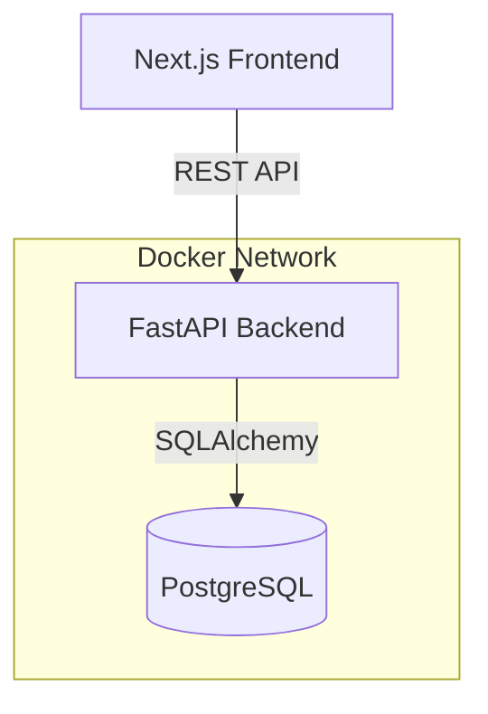
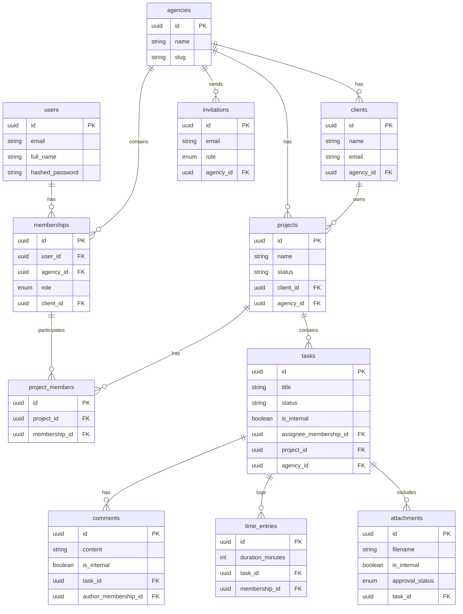
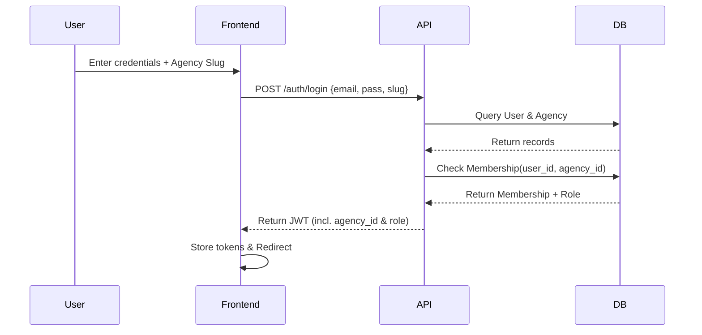
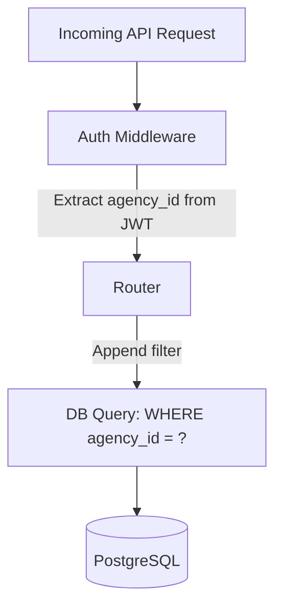

# AgencyDesk

<div align="center">
  
</div>

AgencyDesk is a multi-tenant client portal and project management system designed specifically for digital agencies. It provides a secure, isolated environment where agencies can manage projects, track time, and collaborate with their clients, all within a single application instance.

## Features

- **Multi-tenant Architecture**: Strict data isolation per agency.
- **Client Portals**: Clients can log in to view project progress, approve attachments, and comment.
- **Internal/External Visibility**: Tasks, comments, and attachments can be marked internal-only, hiding them from client view.
- **Kanban Board**: Drag-and-drop task management.
- **Time Tracking**: Log hours against specific tasks.
- **Role-Based Access Control**: Granular permissions for admins, members, and clients.

### Kanban Board


## Live Demo

| Role | Email | Password | Agency Slug |
|------|-------|----------|-------------|
| Agency Admin | admin@agency.com | password123 | vnash-digital |
| Agency Member | member@agency.com | password123 | vnash-digital |
| Client User | client@acme.com | password123 | vnash-digital |

*(Note: The demo database resets daily at midnight UTC)*

## Architecture

### System Architecture



### Database Schema (ERD)



### Auth Flow Sequence



### Multi-tenant Isolation



## The 5 Edge Cases

### 1. Cross-tenant Isolation
Data must never leak between agencies. This is enforced at the query level by requiring the authenticated user's `agency_id` to match the resource's `agency_id`.

```python
def list_projects(agency_id: str, db: Session, membership: Membership):
    # Enforcement: Only query projects matching the current agency
    return db.query(Project).filter(Project.agency_id == agency_id).all()
```

### 2. Internal Content Filtering
Clients should not see tasks, comments, or attachments marked as internal. This is handled by conditionally appending a filter based on the user's role.

```python
query = db.query(Task).filter(Task.project_id == project_id)
if membership.role == "client_user":
    query = query.filter(Task.is_internal == False)
return query.all()
```

### 3. One Person, Two Agencies
A user can belong to multiple agencies with different roles. We model this via a `Membership` table rather than attaching roles directly to the `User`.

```python
class Membership(Base):
    __tablename__ = "memberships"
    id = Column(String, primary_key=True)
    user_id = Column(String, ForeignKey("users.id"))
    agency_id = Column(String, ForeignKey("agencies.id"))
    role = Column(Enum(RoleEnum))
```

### 4. Invite Races
If a user is invited multiple times, or if they register before accepting an invite, we use upsert logic to ensure we do not create duplicate memberships or crash.

```python
existing = db.query(Membership).filter_by(user_id=user.id, agency_id=invite.agency_id).first()
if not existing:
    membership = Membership(user_id=user.id, agency_id=invite.agency_id, role=invite.role)
    db.add(membership)
```

### 5. Safe Assignee Removal
When a user is removed from a project, their assigned tasks must not be orphaned or block deletion. We handle this with database-level `ON DELETE SET NULL` and explicit unassign logic.

```python
db.query(Task).filter(
    Task.project_id == project_id, 
    Task.assignee_membership_id == membership_id
).update({"assignee_membership_id": None})
```

## API Reference

| Resource | Method | Endpoint | Description |
|----------|--------|----------|-------------|
| **Auth** | POST | `/auth/login` | Authenticate and retrieve JWT |
| | POST | `/auth/register` | Create a new user account |
| **Projects** | GET | `/projects/{agency_id}` | List all projects |
| | POST | `/projects/{agency_id}` | Create a new project |
| **Tasks** | GET | `/tasks/{agency_id}/projects/{project_id}/tasks` | List tasks in a project |
| | POST | `/tasks/{agency_id}/projects/{project_id}/tasks` | Create a task |
| | PATCH | `/tasks/{agency_id}/tasks/{task_id}` | Update a task |
| **Comments** | GET | `/comments/{agency_id}/tasks/{task_id}/comments` | List comments |
| | POST | `/comments/{agency_id}/tasks/{task_id}/comments` | Add a comment |
| **Time** | POST | `/time_entries/{agency_id}/tasks/{task_id}/time-entries`| Log time |

## RBAC Matrix

| Action | Agency Admin | Agency Member | Client User |
|--------|--------------|---------------|-------------|
| Create Projects | Yes | Yes | No |
| Create Tasks | Yes | Yes | No |
| View Internal Tasks| Yes | Yes | No |
| View External Tasks| Yes | Yes | Yes |
| Log Time | Yes | Yes | No |
| Approve Attachments| Yes | Yes | Yes |

## Running Locally

### Using Docker (Recommended)

1. Clone the repository
2. Run `docker-compose up --build`
3. The frontend will be available at `http://localhost:3000` and the backend API at `http://localhost:8000`

### Manual Setup

**Backend:**
```bash
cd backend
python -m venv venv
source venv/bin/activate
pip install -r requirements.txt
uvicorn main:app --reload
```

**Frontend:**
```bash
cd frontend
npm install
npm run dev
```

## Running Tests

Navigate to the `backend` directory and run pytest:
```bash
cd backend
pytest
```
