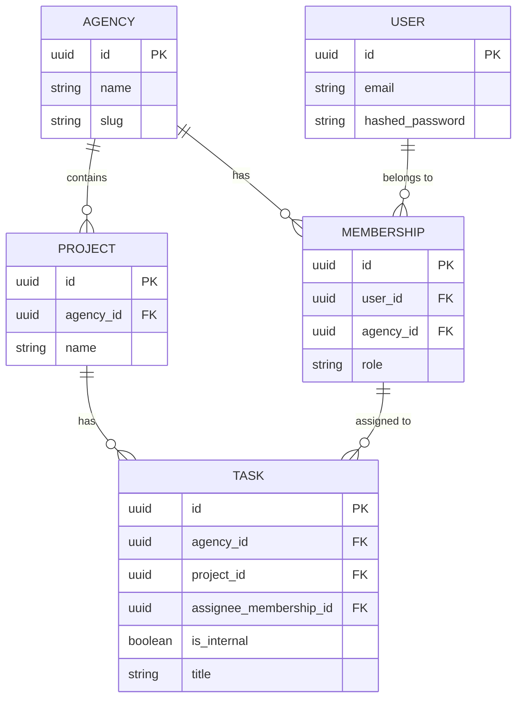
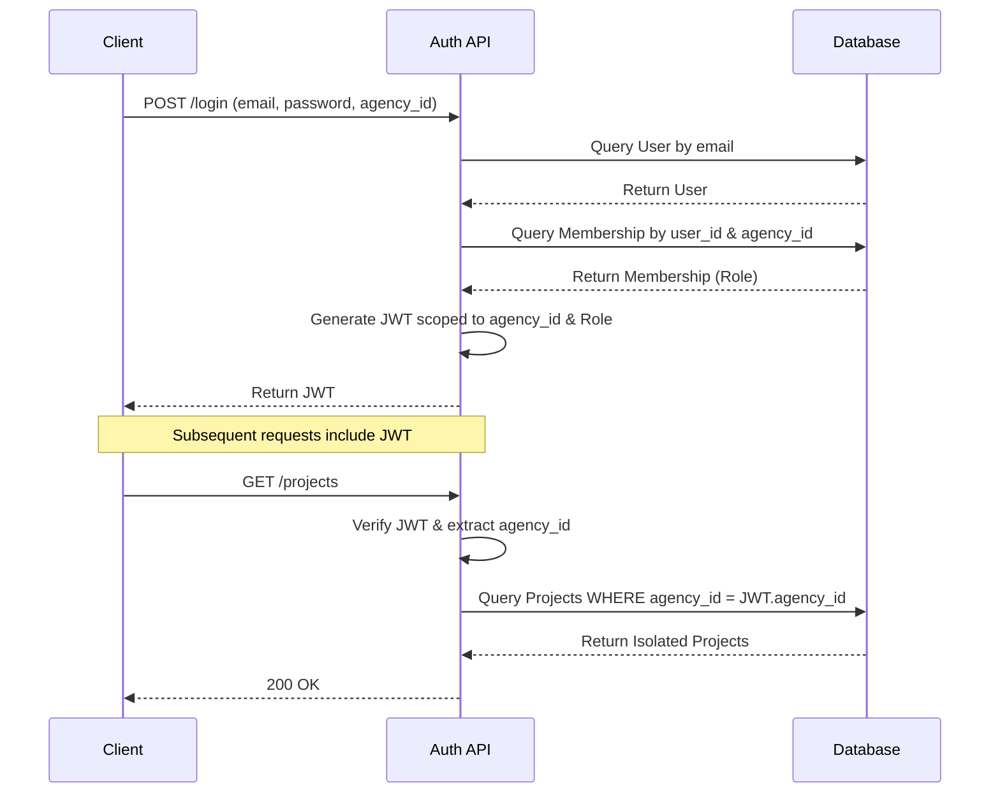

# AgencyDesk 🚀

> A cutting-edge, multi-tenant agency & client management platform built with Next.js 14, FastAPI, and PostgreSQL.

AgencyDesk is designed from the ground up to handle complex multi-tenant environments. It features rigorous data isolation, comprehensive client visibility filtering, and a flexible multi-agency identity model.

---

## 🏗 Architecture Overview

AgencyDesk leverages a robust, decoupled architecture:
- **Frontend**: Next.js 14 with App Router, TailwindCSS, and shadcn/ui.
- **Backend**: FastAPI for high-performance, async API endpoints.
- **Database**: PostgreSQL with strict row-level multitenancy, powered by SQLAlchemy and Alembic.

---

## ✨ Features

- **Strict Tenant Isolation**: Data is separated by `agency_id` at the database level.
- **Role-Based Visibility**: Internal data (tasks, comments, attachments) are safely hidden from client users.
- **Multi-Agency Identity**: A single user identity can participate across multiple agencies with different roles.
- **Idempotent Invites**: Bulletproof member invitation logic.
- **Safe Removal**: Prevent cascading deletes when removing agency members.

---

## 📊 Core Flows & Mermaid Diagrams

### 1. Database Schema Overview


### 2. Multi-Tenant Auth Flow


---

## 🚀 Getting Started

### Prerequisites
- Docker & Docker Compose
- Node.js >= 18 (for local development)
- Python >= 3.11 (for local development)

### Running the Stack via Docker
1. Clone the repository:
   ```bash
   git clone <repo-url> && cd agency-desk
   ```
2. Start the services:
   ```bash
   docker-compose up --build
   ```
3. The backend applies migrations and seeds the database automatically.
4. Open the frontend: [http://localhost:3000](http://localhost:3000)
5. Backend API Docs: [http://localhost:8000/docs](http://localhost:8000/docs)

### Demo Credentials

The `seed.py` creates demo users (Password for all: `password123`):

| Agency | Role | Email |
|--------|------|-------|
| Alpha  | Admin | `admin@alpha.com` |
| Alpha  | Member | `member@alpha.com` |
| Alpha  | Client | `client@acme.com` |
| Beta   | Admin | `admin@beta.com` |
| Both   | Mixed | `crossuser@example.com` |

---

## 🧪 Testing

The backend includes a comprehensive pytest suite covering the 5 critical edge cases:
- Tenant isolation
- Visibility filtering
- Multi-agency auth
- Invite idempotency
- Safe removal

```bash
cd backend
python -m venv venv
source venv/bin/activate
pip install -r requirements.txt
PYTHONPATH=. pytest tests/ -v
```

---
*Built with passion to manage the world's best agencies.*
